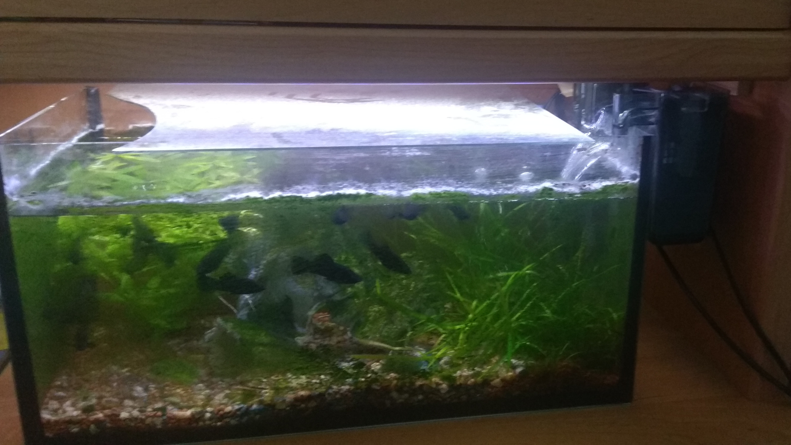
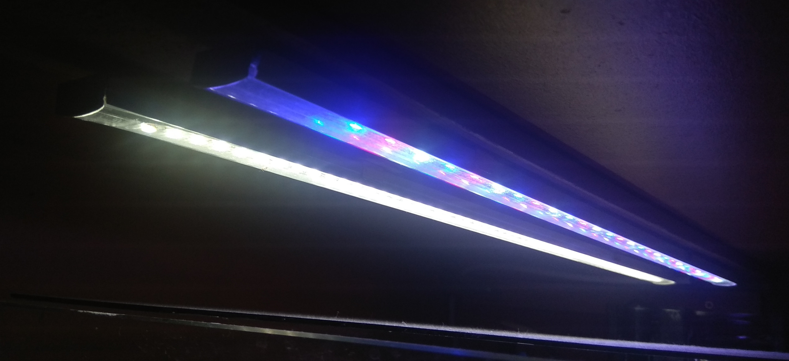
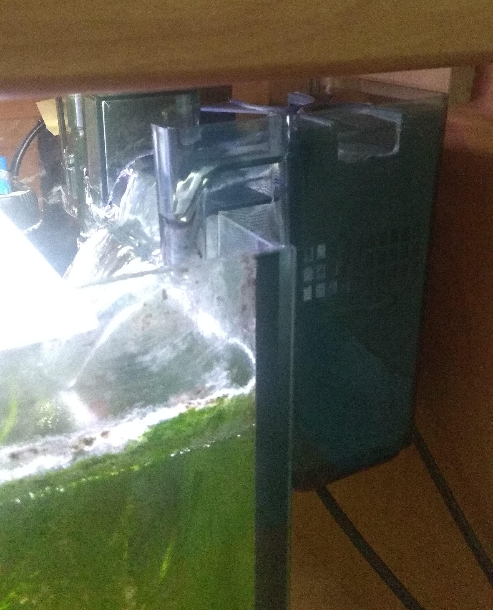
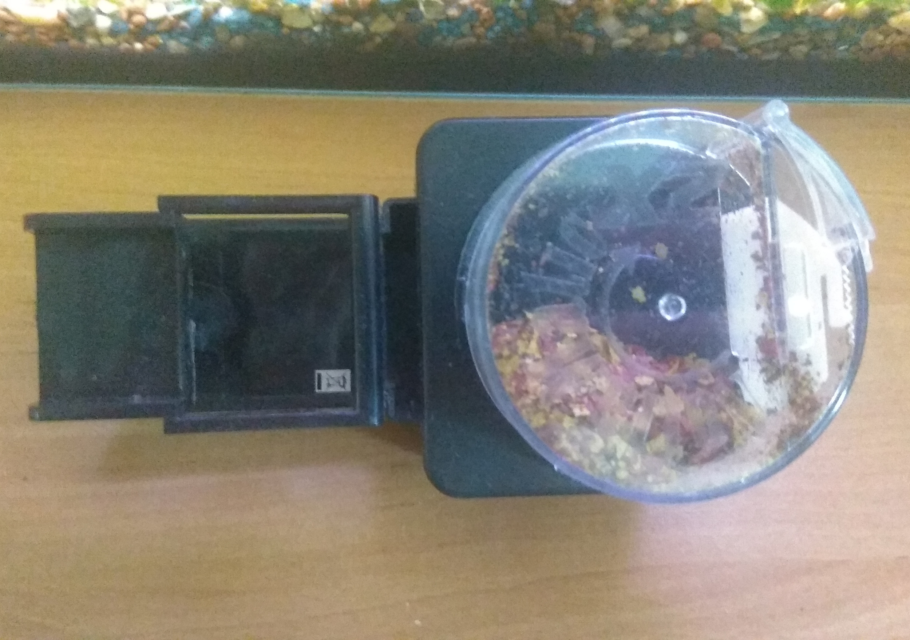
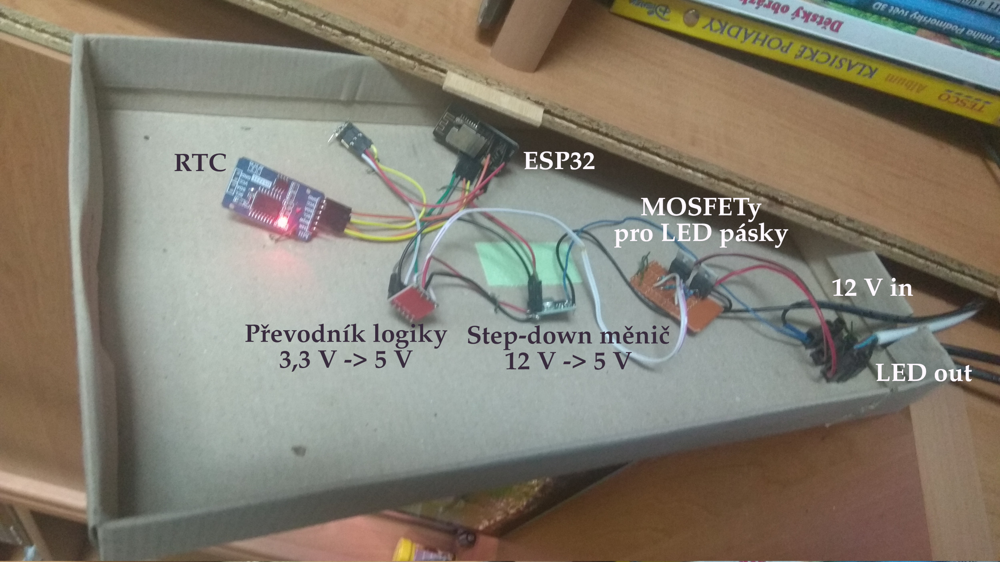

% !TeX encoding = UTF-8

# Bakalářská práce -- poznámky

## Cíl
Vytvoření zařízení pro kontrolu a ovládání domácího akvária. Jedná se o kompletní přepracování a rozšíření mého staršího projektu z doby gymnaziální.

Požadovaná funkčnost:
- Ovládání světel
- Kontrola teploty a výšky hladiny
- Vzdálený přístup k systému přes webové rozhraní
- Vše na jedné DPS + konektory pro senzory a napájení

Rád bych přidal, ale ještě musím promyslet:
- Ovládání filtru vody (zapnutí/vypnutí)
- Automatické krmítko
- Případně další senzory, kamera

Chci se snažit zařízení připravit co nejvíce tak, aby bylo možné ho začít prodávat (to není mým cílem, ale přijde mi, že se tam naučím dělat věci správně), tedy aby byla práce s ním intuitivní a nebylo potřeba diplomu jen k tomu, aby ho uživatel zapnul a nastavil.

## Popis akvária pro představu
Jedná se o malé domácí akvárium o objemu přibližně 30 litrů. Pro správnou funkci je potřeba regulovat teplotu vody, filtrovat a doplňovat vodu, také je potřeba svítit a to nejlépe s plynulým rozsvěcováním a zhasínáním. Rybky krmíme 1 až 2 krát denně ručně, v případě dovolené instalujeme automatické krmítko na tužkové baterie.

## Popis verze Alpha :)

Starší středoškolský projekt je vytvořený na úrovni modulů, je použit kontroler ESP32, na kterém běží webserver. Zařízení slouží pouze k ovládání světel, přes webovou stránku lze nastavit čas a rychlost rozsvícení a zhasnutí.

Kód je psán v Arduino frameworku, což byla v danou chvíli rozumná volba, ale teď bych se mu rád pokusil vyhnout. 
Pro ovládání světel (LED pásky) jsem použil mosfet tranzistory řízené PWM pinem, také nebyly zvoleny vhodně, musel jsem použít předovník úrovně z 3.3 V na 5 V, aby bylo možné tranzistor plně otevřít.

Za běžných podmínek zařízení funguje, ale například po výpadku elektřiny často končí v bootovací smyčce a je potřeba ručně zmáčknout reset, na stabilitu bych se tedy taky rád zaměřil.

## Senzory
Jednou variantou je připojení každého senzoru zvlášť na konkrétní místo s tím, že doplňující obvody (pull-up / pull-down rezistory, kapacitory, ...) budou přímo na hlavní DPS, toto řešení je ale málo flexibilní a hrozí chybné zapojení uživatelem.

Lepším řešením by byl univerzální konektor pro všechny senzory, doplňující součástky pak musejí být přímo v modulu senzoru společně s velmi málo náročným mikrokontrolerem tak, aby všechny senzory z pohledu hlavního zařízení využívaly stejný komunikační protokol. Tento systém mi přijde také mnohem lépe rozšiřitelný.

Senzory, které chci vytvořit:
- Teploměr
- Výška hladiny vody
- Kontrola průtoku vody filtrem (ještě potřeba promyslet)
- Volitelně: Osvětlení, PH, další parametry vody

## Existující řešení
### Komerční řešení
- GHL
  - Komplexní, asi nejlepší na trhu.
  - Cena setu až ke 30 000 Kč.
  
- Neptune Systems - Apex
  - Komplexní, také jeden ze špičky na trhu.
  - Cena setu přes 20 000 Kč.
  
- Hydros
  - Komplexní, modulární systém.
  - Cena setu do 10 000 Kč, ale je méně obsáhlý.
  
- Seneye
  - Pouze monitoring
  
- Jednotlivé jednoúčelové produkty (samostatné ovládání světel, krmení, ...)
  - Pro menší domácí akvária, nižší cena, ale komplikované nastavení 

### DIY řešení
- Vzorová diplomka -- akvarium
- Pěkně zpracovaný kontroler pro terárium [zde](https://brushknight.medium.com/terrarium-controller-idea-%EF%B8%8F-v1-4-b8ee96cfbd22)

## Plán práce
1. Průzkum trhu a existujících řešení
2. Volba konkrétních senzorů
   1. Test různých typů
   2. Volba komunikačního protokolu
   3. Na breadboardu, nejlépe už základní kód v ESP IDF
3. Seznámení s ESP IDF
4. Vyřešení ovládání světel -- volba vhodných MOSFETů + test
5. Ovládání periferií 230V -- rozhodnutí smart plug vs svorkovnice
6. Návrh schématu s devkitem
7. Prototyp s devkitem -- test
8. Schéma bez devkitu, layout DPS
9. Objednání DPS, osazení, test
10. (Oprava chyb, možná nová DPS) -- možné opakování tohoto kroku
11. firmware + řídící software
12. Test v provozu
